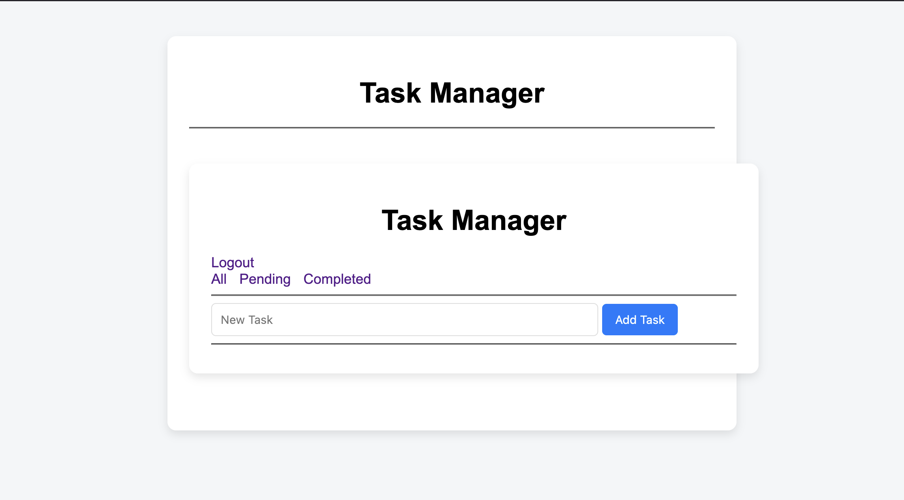

# PHP Task Manager

A lightweight **Task Manager Web Application** built with **PHP and MySQL** that allows users to manage daily tasks efficiently.

The application includes authentication, task management features, and filtering options to organize tasks easily.

---

## 🚀 Features

* User Registration & Login
* Session-based Authentication
* Create New Tasks
* Mark Tasks as Completed
* Delete Tasks
* Filter Tasks

  * All Tasks
  * Pending Tasks
  * Completed Tasks

---

## 🛠️ Technologies Used

| Technology | Purpose                  |
| ---------- | ------------------------ |
| PHP        | Backend Logic            |
| MySQL      | Database                 |
| HTML       | Structure                |
| CSS        | Styling                  |
| JavaScript | Client-side Interactions |

---

## 📸 Screenshot



---

## 📂 Project Structure

```
php-task-manager/
│
├── auth/          # Login & Register logic
├── tasks/         # Task CRUD operations
├── includes/      # Database connection & shared files
├── image/         # Screenshots and images
│
├── index.php      # Main application entry
├── style.css      # Styling
└── README.md
```

---

## ⚙️ Installation

1️⃣ Clone the repository

```
git clone https://github.com/YOUR_USERNAME/php-task-manager.git
```

2️⃣ Move the project to your local server

Example:

* **XAMPP:** `htdocs/`
* **Laragon:** `www/`

3️⃣ Create a MySQL database

Example database name:

```
task_manager
```

4️⃣ Import the SQL file (if available)

5️⃣ Configure the database connection

Edit:

```
includes/db.php
```

Example:

```
$host = "localhost";
$user = "root";
$password = "";
$dbname = "task_manager";
```

6️⃣ Start Apache & MySQL

Open in browser:

```
http://localhost/php-task-manager
```

---

## 📌 Future Improvements

* Task editing feature
* Due date support
* Task categories
* Responsive mobile UI
* Dark mode

---

## 👩‍💻 Author

**Diya Taib Ismahil**

Computer Science Developer
Interested in **Web Development, UI/UX, and Full Stack Engineering**

GitHub:
https://github.com/DIYA73

---

⭐ If you like this project, consider giving it a star!
